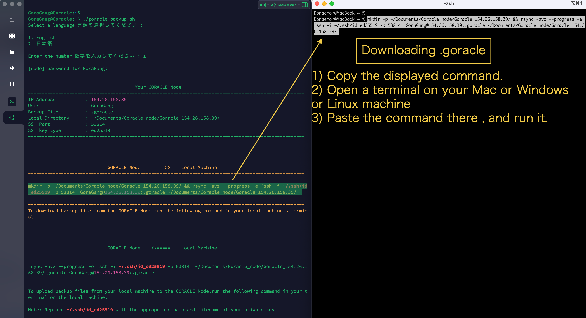
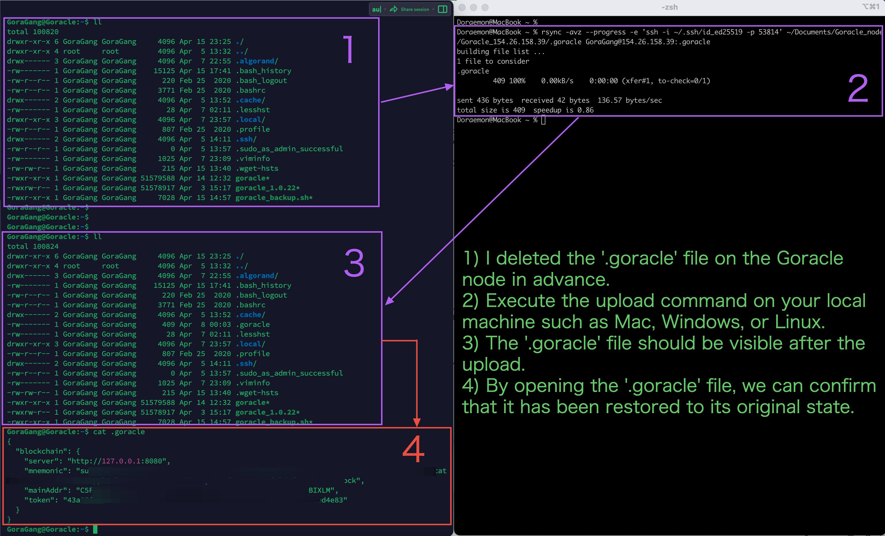

<br/>
<p align="center">

</a>
</p>
<br/>

# goracle_backup

[README Japanese](https://github.com/Moon1215i/goracle_backup/blob/main/translations/README_JP.md)
 
<br>
<br>

# 1. Overview
1. Create a command to transfer the `.goracle` file in the home directory of the Goracle node to a local machine using `rsync`.
2. Also create a command to transfer backup files from the local machine to the Goracle node.
3. Please check in advance if there is a `.goracle` file on the Goracle node.
4. Supports various ciphers. Below is a list of key types for keys that may be detected by the script:
     * ssh-dss
     * ssh-rsa
     * ecdsa-sha2-nistp
     * ssh-ed25519
     * rsa-sha2-256
     * ssh-x25519
     * ssh-x448
  
     Therefore, this script detects key types of DSA, RSA, ECDSA, Ed25519, RSA-PSS, x25519, and x448. 
5. Supports Japanese and English
     * Created `translations.csv` to correspond to Japanese and English.
     * If necessary, we can also support other languages, so please let us know.
 
<br>
<br>

# 2. Features
1. Reads English and Japanese messages from a CSV file and displays messages according to the selected language.
2. Creates a command to transfer `.goracle` from the Goracle node to the local machine.
3. Also creates a command to transfer backup files from the local machine to the `.goracle` on the Goracle node.
4. This repository also supports `ssh-key`.
 
<br>
<br>

# 3. About rsync's features
`rsync` is a file synchronization tool used primarily to synchronize files/directories located in different places. rsync can transfer files between a local machine and a remote machine and transfer files over a network.

The main feature of rsync is that it can transfer only the changed parts. That is, by calculating the difference between the source and destination files and transferring only the parts with differences, it operates very efficiently when transferring large amounts of data.

In addition, rsync has other advantages such as the following.

* If the transfer is interrupted in the middle, it can be resumed from the middle.
* When synchronizing multiple files, it can be faster than scp.
* Progress status is displayed during the transfer, making it easy to check the transfer status.

The Goracle node probably has rsync installed. You can check it with `rsync --version`. 


<br>

If it is not installed, please run the following command to install it.

```sh
sudo apt install rsync
```
 
<br>
<br>

## 4. スクリプトの実行

<!--
リポジトリを`git clone`し、`goracle_backup`ディレクトリに入り、`goracle_backup.sh`の実行権限を変更します。
```sh
git clone https://github.com/Moon1215i/goracle_backup
cd goracle_backup
chmod +x goracle_backup.sh
```
もしくは -->
<br>

### 4-1 Download and set permissions for goracle_backup.sh on Goracle node
Run the following command to download the `goracle_backup.sh` file from the **[GitHub repository](https://github.com/Moon1215i/goracle_backup)** to the Goracle node's home directory and change the file's permissions to allow execution.

```
cd ~ && \
curl -O https://raw.githubusercontent.com/Moon1215i/goracle_backup/main/goracle_backup.sh && \
chmod +x goracle_backup.sh
```


<br>

### 4-2
シェルスクリプトを実行します
```sh
./goracle_backup.sh
```

* 英語か日本語を選択します。パスワードを求めらた場合は、入力します。

以下のようなプロンプトになります。

* `IP Address : 12.34.56.78`　は例えです。

```sh
GoraGang@Goracle:~$ ./goracle_backup.sh 

Select a language 言語を選択してください :

1. English
2. 日本語

Enter the number 数字を入力してください : 2


                                       Your GORACLE Node                                          
-----------------------------------------------------------------------------------------------------
IP Address           : 12.34.56.78
User                 : GoraGang
Backup File          : .goracle
Local Directory      : ~/Documents/Goracle_node/Goracle_12.34.56.78/
SSH Port             : 54865
SSH key type         : ed25519
-----------------------------------------------------------------------------------------------------


                             ゴラクルノード    =====>>    ローカルマシン                       
-----------------------------------------------------------------------------------------------------

mkdir -p ~/Documents/Goracle_node/Goracle_12.34.56.78/ && rsync -avz --progress -e 'ssh -i ~/.ssh/id_ed25519 -p 54865' GoraGang@12.34.56.78:.goracle ~/Documents/Goracle_node/Goracle_12.34.56.78/

-----------------------------------------------------------------------------------------------------
ゴラクルノードからバックアップファイルをダウンロードするには、ローカルマシンの端末で次のコマンドを実行します


                             ゴラクルノード    <<=====    ローカルマシン                              
-----------------------------------------------------------------------------------------------------

rsync -avz --progress -e 'ssh -i ~/.ssh/id_ed25519 -p 54865' ~/Documents/Goracle_node/Goracle_12.34.56.78/.goracle GoraGang@12.34.56.78:.goracle

-----------------------------------------------------------------------------------------------------
-----------------------------------------------------------------------------------------------------
ローカルマシンからバックアップファイルをゴラクルノードにアップロードするには、ローカルマシンのターミナルで次のコマンドを実行します

重要:  ~/.ssh/id_ed25519 の箇所は、適切なパスと秘密鍵のファイル名に置き換えてください
```

<br>

### 4-3

1. 上記の2つの`rsync`コマンドをコピーして、メモ帳にでも保存してください。
2. **SSH Keyは、実際にご自身がお使いのパスとファイル名に変更してください。**
 
<br>
<br>

# 5. ローカルマシン（Linux,Mac,WSL2の場合）

Terminalを開いて、先ほどのコマンドを貼り付けて、実行してください。
 
## 5-1 Downloading '.goracle'



1. Copy the displayed command.
2. Open the terminal on your regular machine such as Mac, Windows, or Linux.
3. Paste the command there and run it.


## 5-2 Uploading '.goracle'


1. Copy the displayed command.
2. Open the terminal on your regular machine such as Mac, Windows, or Linux.
3. Paste the command there and run it.



 1. I deleted the `.goracle` file on the Goracle node in advance.
 2. Execute the upload command on your local machine such as Mac, Windows, or Linux.
 3. The `.goracle` file should be visible after the upload.
 4. By opening the `.goracle` file, we can confirm that it has been restored to its original state.

<br>
<br>

Note: 
* Linux（Ubuntu）,Mac,WSL2 (Windows Subsystem for Linux 2) ,Windows10及び11(Cygwin使用)で動作確認ができました。
 
<br>
<br>

# Auther

@Moon1215i

<br>

**Github**<br>
https://github.com/Moon1215i

<br>  

**Goracle Node SETUP INSTRUCTIONS【English & 日本語】**<br>
https://qiita.com/Moon1215i/items/72d7d98d3a2269f177ef

<a href="https://qiita.com/Moon1215i/items/72d7d98d3a2269f177ef"></a>

<br>

**Algorand Node with Goracle【English & 日本語】**<br>
https://qiita.com/Moon1215i/items/eb4f40c2337ae9b7bf0f

<a href="https://qiita.com/Moon1215i/items/eb4f40c2337ae9b7bf0f"></a>

<br>

**Twitter** <br>
https://twitter.com/Moon1215i

<a href="https://twitter.com/Moon1215i"></a>