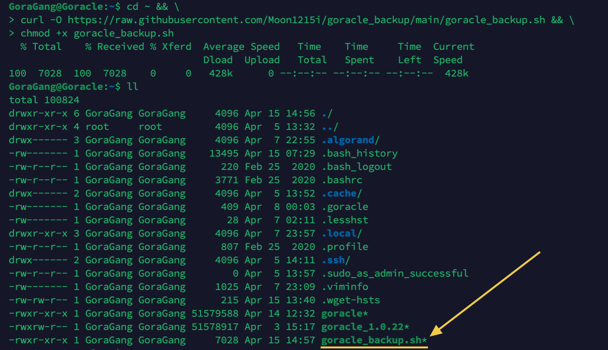

<br/>
<p align="center">

</a>
</p>
<br/>

# Goracle Backup Repository

[README Japanese](https://github.com/Moon1215i/goracle_backup/blob/main/translations/README_JP.md)

`.goracle` is the configuration file for the Goracle node, containing the account information required for the node to participate in the Algorand network, as well as the connection details for the Algorand node that the Goracle node will use. This file is created during the initialization of the Goracle node and is critical for backing up, restoring, and migrating the Goracle node to another VPS. As such, backing up this file is the top priority for Goracle node operators and will be necessary in case of Goracle node or VPS failure, or when migrating to another VPS. I have created a repository that can assist with backup and restoration, which I hope will be useful for the Goracle team and GoraGang members.
<br>

**@Moon1215i**
 
<br>
<br>

# 1. Overview
1. Create a command to transfer the `.goracle` file in the home directory of the Goracle node to a local machine using `rsync`.
2. Also create a command to transfer backup files from the local machine to the Goracle node.
3. Please check in advance if there is a `.goracle` file on the Goracle node.
4. Supports various ciphers. Below is a list of key types for keys that may be detected by the script:
     * ssh-dss
     * ssh-rsa
     * ecdsa-sha2-nistp
     * ssh-ed25519
     * rsa-sha2-256
     * ssh-x25519
     * ssh-x448
  
     Therefore, this script detects key types of DSA, RSA, ECDSA, Ed25519, RSA-PSS, x25519, and x448. 
5. Supports Japanese and English
     * Created `translations.csv` to correspond to Japanese and English.
     * If necessary, we can also support other languages, so please let us know.
 
<br>
<br>

# 2. Features
1. Reads English and Japanese messages from a CSV file and displays messages according to the selected language.
2. Creates a command to transfer `.goracle` from the Goracle node to the local machine.
3. Also creates a command to transfer backup files from the local machine to the `.goracle` on the Goracle node.
4. This repository also supports `ssh-key`.
 
<br>
<br>

# 3. About rsync's features
`rsync` is a file synchronization tool used primarily to synchronize files/directories located in different places. rsync can transfer files between a local machine and a remote machine and transfer files over a network.

The main feature of rsync is that it can transfer only the changed parts. That is, by calculating the difference between the source and destination files and transferring only the parts with differences, it operates very efficiently when transferring large amounts of data.

In addition, rsync has other advantages such as the following.

* If the transfer is interrupted in the middle, it can be resumed from the middle.
* When synchronizing multiple files, it can be faster than scp.
* Progress status is displayed during the transfer, making it easy to check the transfer status.

The Goracle node probably has rsync installed. You can check it with `rsync --version`. 


<br>

If it is not installed, please run the following command to install it.

```sh
sudo apt install rsync
```
 
<br>
<br>

## 4. The 'goracle_backup' Repository

Download and run goracle_backup.sh from the goracle_backup repository. All other files are used as temporary files and will be automatically deleted when the script ends.

<!--
リポジトリを`git clone`し、`goracle_backup`ディレクトリに入り、`goracle_backup.sh`の実行権限を変更します。
```sh
git clone https://github.com/Moon1215i/goracle_backup
cd goracle_backup
chmod +x goracle_backup.sh
```
もしくは -->

<br>

### 4-1 Download and set permissions for goracle_backup.sh on Goracle node
<br>

Run the following command to download the `goracle_backup.sh` file from the **[GitHub repository](https://github.com/Moon1215i/goracle_backup)** to the Goracle node's home directory and change the file's permissions to allow execution.

<br>

```
cd ~ && \
curl -O https://raw.githubusercontent.com/Moon1215i/goracle_backup/main/goracle_backup.sh && \
chmod +x goracle_backup.sh
```



<br>

### 4-2 Running the Goracle backup shell script

Please run the following shell script:

```sh
./goracle_backup.sh
```

* When prompted, select either English or Japanese and enter your password if requested.

<br>
You will see the following prompt:

* `IP Address: 12.34.56.78` is just an example.

```sh
GoraGang@Goracle:~$ ./goracle_backup.sh 

Select a language 言語を選択してください :

1. English
2. 日本語

Enter the number 数字を入力してください : 1

[sudo] password for GoraGang: 


                                       Your GORACLE Node                                          
-----------------------------------------------------------------------------------------------------
IP Address           : 12.34.56.78
User                 : GoraGang
Backup File          : .goracle
Local Directory      : ~/Documents/Goracle_node/Goracle_12.34.56.78/
SSH Port             : 53814
SSH key type         : ed25519
-----------------------------------------------------------------------------------------------------


                             GORACLE Node    =====>>    Local Machine                             
-----------------------------------------------------------------------------------------------------

mkdir -p ~/Documents/Goracle_node/Goracle_12.34.56.78/ && rsync -avz --progress -e 'ssh -i ~/.ssh/id_ed25519 -p 53814' GoraGang@12.34.56.78:.goracle ~/Documents/Goracle_node/Goracle_12.34.56.78/

-----------------------------------------------------------------------------------------------------
To download a backup file from the GORACLE Node, run this command in your local machine's terminal.


                             GORACLE Node    <<=====    Local Machine                             
-----------------------------------------------------------------------------------------------------

rsync -avz --progress -e 'ssh -i ~/.ssh/id_ed25519 -p 53814' ~/Documents/Goracle_node/Goracle_12.34.56.78/.goracle GoraGang@12.34.56.78:.goracle

-----------------------------------------------------------------------------------------------------
To upload a backup file from your local machine to the GORACLE node, run this command in your local machine's terminal.


Note: Replace ~/.ssh/id_ed25519 with the appropriate path and filename of your private key.
```

<br>

### 4-3 Copying Rsync Commands and Editing SSH Key Path and Filename

1. Copy and save the above two `rsync` commands to a text editor or somewhere else.
2. **Replace the SSH key path and filename with your own actual path and filename.**
 
<br>
<br>

# 5. Executing from local machine

Please run the following command on your local machine's Terminal, whether it is Mac, Windows, or Linux:

<br>

## 5-1 Downloading '.goracle'


1. Copy the displayed command.
2. Open the terminal on your regular machine such as Mac, Windows, or Linux.
3. Paste the command there and run it.

<br>


Please check that the .goracle file has been downloaded by opening the .ssh folder.

<br>

**Below are the locations and instructions for finding the `.ssh` folder on each operating system:**
<br>

### Mac
The `.ssh` folder is located in the `hidden folder` of the user's home directory. To show the .ssh folder in Finder, open the user's home folder and press `Command+Shift+.(dot).` The `.ssh` folder will be displayed.
<br>

### Windows
The `.ssh` folder is usually located in the `hidden folder` of the user's home directory. To display the folder, you need to change the display option in Explorer. Follow [this article](https://www.howtogeek.com/446/show-hidden-files-and-folders-in-windows/) to learn how to display hidden folders.
<br>

### Linux
The `.ssh` folder is located in the user's home directory. You can navigate to the `.ssh` folder by running `cd ~/.ssh` in the terminal. If the `.ssh` folder does not exist, you can generate a key pair using the `ssh-keygen` command.
<br>
<br>

## 5-2 Uploading '.goracle'


1. Copy the displayed command.
2. Open the terminal on your regular machine such as Mac, Windows, or Linux.
3. Paste the command there and run it.

<br>


 1. I deleted the `.goracle` file on the Goracle node in advance.
 2. Execute the upload command on your local machine such as Mac, Windows, or Linux.
 3. The `.goracle` file should be visible after the upload.
 4. By opening the `.goracle` file, we can confirm that it has been restored to its original state.

<br>
<br>

Note: 
* Linux（Ubuntu）,Mac,WSL2 (Windows Subsystem for Linux 2) ,Windows10及び11(Cygwin使用)で動作確認ができました。
 
<br>
<br>

# 6. Q & A

**Question:**<br>
Is it possible to hard reset or change the VPS where my Goracle node is set up?

<br>

**Answer:**<br>
Yes, it is possible. Simply copy the contents of your existing `~/.goracle` config file to the new VPS where you are setting up your Goracle node. Alternatively, you can also run `./goracle init` on the new VPS using the config from the existing `.goracle` config file.

<br>

**Supplement**<br>
You can use `SFTP` to backup and restore `.goracle` files. SFTP (Secure File Transfer Protocol) is an encrypted file transfer protocol that extends the FTP protocol. SFTP encrypts authentication credentials and transferred files using the SSH protocol, which improves security against man-in-the-middle attacks and protects the confidentiality of files during transfer. SFTP is included as a standard feature in operating systems such as Linux and UNIX, making it widely available on many servers.

Some well-known SFTP client applications include `FileZilla`, `WinSCP`, and `PuTTY`, and it is also included in terminal software such as `Termius`. These apps are available on many operating systems, including Windows, Mac, and Linux.</p>

<br>
<br>

# Auther

@Moon1215i

<br>

**Github**<br>
https://github.com/Moon1215i

<br>  

**Goracle Node SETUP INSTRUCTIONS【English & 日本語】**<br>
https://qiita.com/Moon1215i/items/72d7d98d3a2269f177ef

<a href="https://qiita.com/Moon1215i/items/72d7d98d3a2269f177ef"></a>

<br>

**Algorand Node with Goracle【English & 日本語】**<br>
https://qiita.com/Moon1215i/items/eb4f40c2337ae9b7bf0f

<a href="https://qiita.com/Moon1215i/items/eb4f40c2337ae9b7bf0f"></a>

<br>

**Twitter** <br>
https://twitter.com/Moon1215i

<a href="https://twitter.com/Moon1215i"></a>
