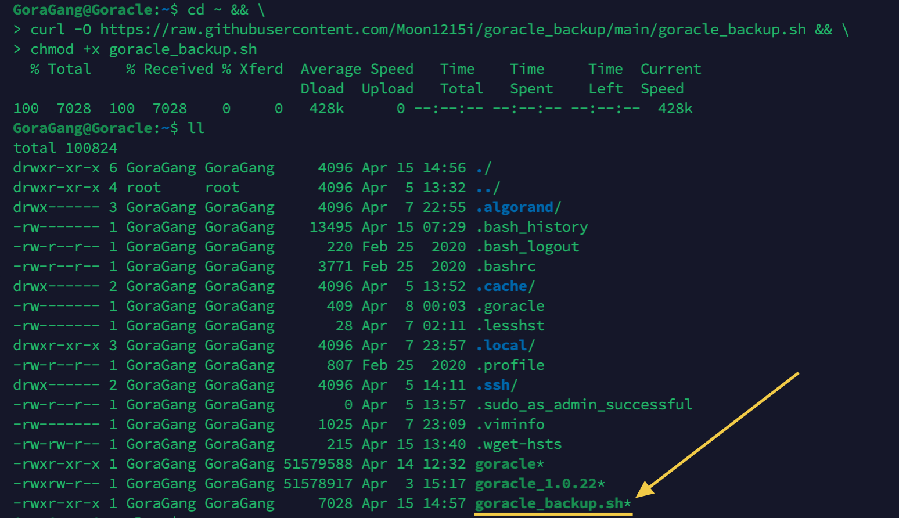
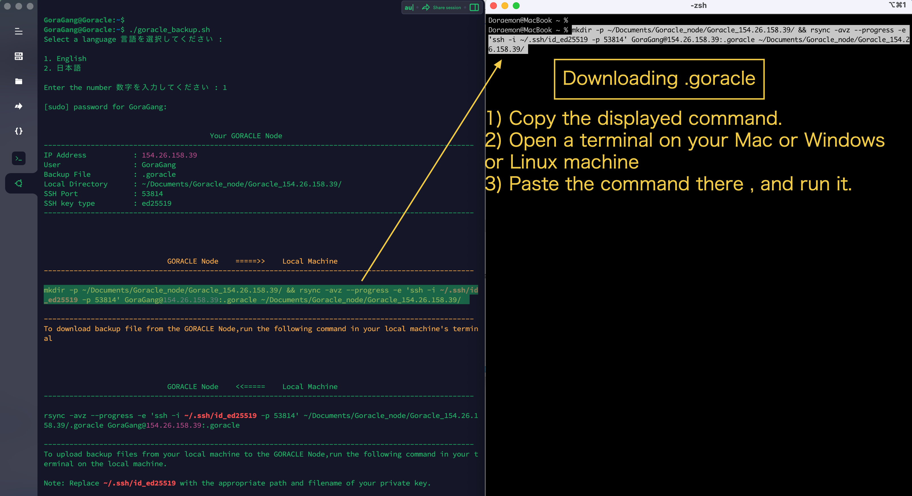
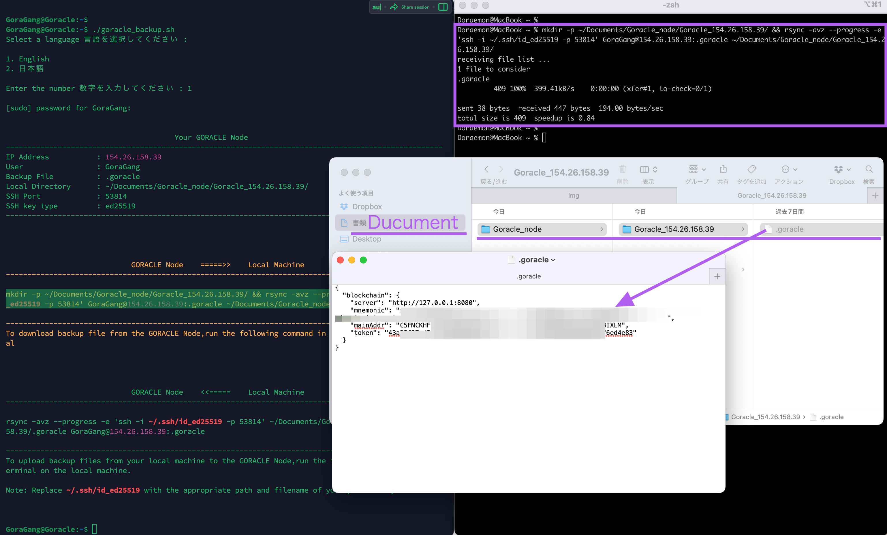
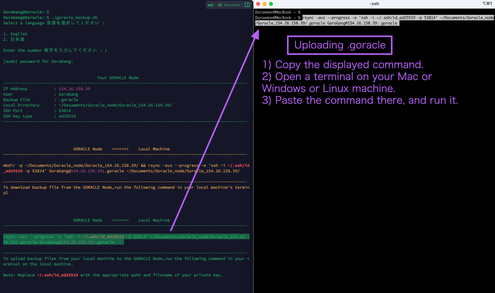
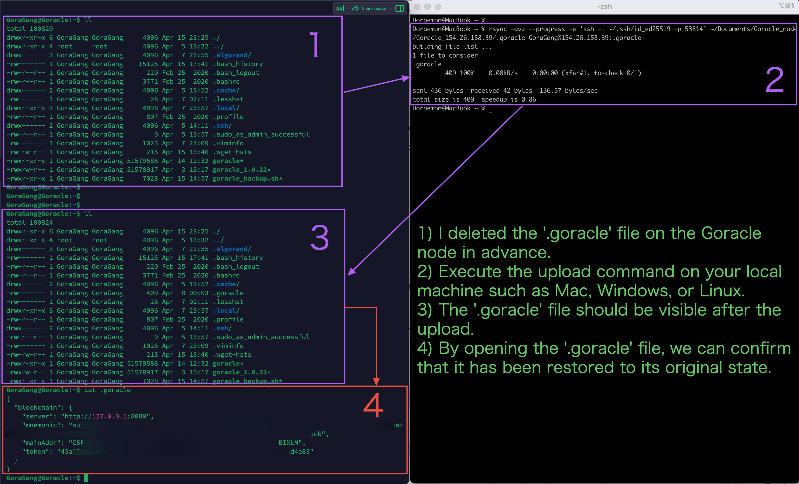
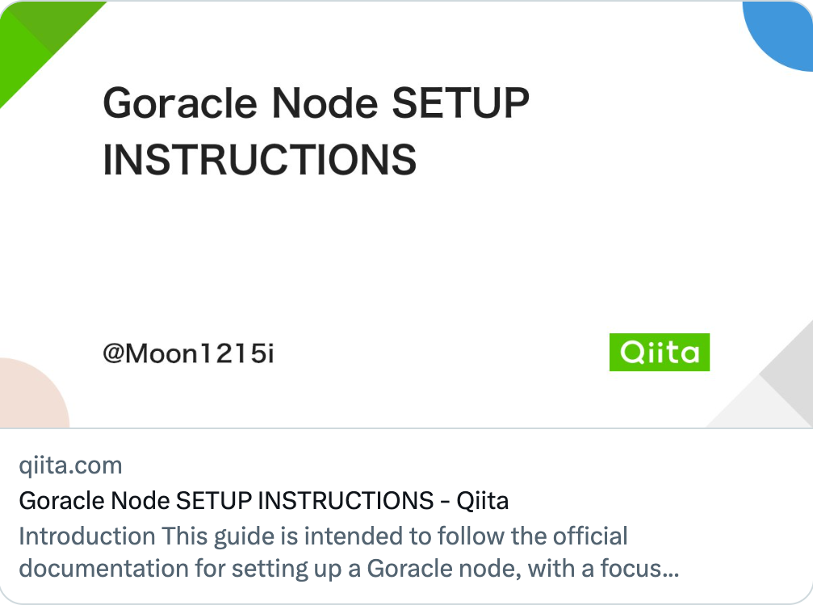
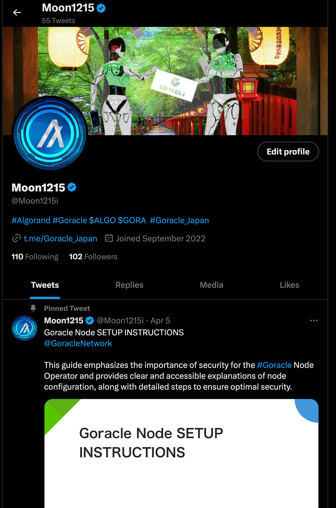

<br/>
<p align="center">

</a>
</p>
<br/>

# Goracle Backup Repository for Mac & Linux Users
**Mac & Linux ユーザーのためのGoracleバックアップリポジトリ**

[README English](https://github.com/Moon1215i/goracle_backup)

`.goracle`は、Goracleノードの設定ファイルで、Algorandネットワーク上のGoracleノードが参加するためのアカウントと、Algorandノードへの接続情報が含まれています。Goracleノードを初期化する際に、このファイルが作成されます。この極めて重要なファイルをバックアップすることは、Goracleノードオペレーターにとって最優先のタスクです。また、Goracleノードの不具合やVPSの問題、別のVPSに移行する際にも必要となります。このため、バックアップや復元に役立つリポジトリを作成しました。GoracleチームやGoraGangの方々がお役に立てることを願っています。

このバックアップリポジトリは、MacとLinuxユーザー向けで、Windowsユーザーには役に立たないかもしれません。Goracleノードはオペレーターにとって非常に使いやすく、設定ファイルもメモ帳にコピー&ペーストで保存できるほどシンプルです。また、`SFTP`を使用すればファイルのコピーも見やすくできます。リポジトリを作成するほどのことではありませんが、コマンドプロンプトを使用してファイルをコピーすることも可能です。Goracleノードに関連するものなので、ここで共有します。ちなみに、プロンプトは英語と日本語に対応しており、他の言語も追加することが可能です。興味がある方はぜひ試してみてください。

**@Moon1215i**

<br>
<br>

# 1. 概要
1. `rsync`を使って、ゴラクルノードのホームディレクトリ内にある`.goracle`ファイルを、VPSからローカルマシンに転送できるコマンドを作成します
2. 同時に、ローカルマシンからゴラクルノードへバックアップファイルを転送できるコマンドも作成します
3. ゴラクルノードに`.goracle`ファイルがあるどうかを、事前に確認してください。
4. 各種暗号に対応。以下は、スクリプトで検出される可能性のあるファイルがある鍵のタイプのリストです
     * ssh-dss
     * ssh-rsa
     * ecdsa-sha2-nistp
     * ssh-ed25519
     * rsa-sha2-256
     * ssh-x25519
     * ssh-x448

     したがって、このスクリプトでは、DSA、RSA、ECDSA、Ed25519、RSA-PSS、x25519、x448の鍵タイプを検知します

5. 日本語と英語に対応
     * `tranlations.csv`を作成し、日本語と英語に対応させました
     * 必要であれば、他の言語にも対応しますので、お知らせください
6. **非推奨<br>Windowsで`rsync`や`scp`を使うためには、`WSL2`や`Cygwin`を別途セットアップする必要があります。それらはご自身で確認してください。私はサポート外とさせていただきます。**
   
<br>
<br>

# 2. 機能
1. CSVファイルから英語と日本語のメッセージを読み込み、選択された言語に応じてメッセージを表示します
2. ゴラクルノードの`.goracle`を、ローカルに転送するコマンドを作成します
3. 同時に、ローカルからゴラクルノードへ、バックアップファイルを`.goracle`に転送するコマンドも作成します
4. このリポジトリは、`ssh-key`にも対応しています
 
<br>
<br>

# 3. rsyncの機能について
`rsync`は、ファイル同期ツールで、主に異なる場所にあるファイル/ディレクトリを同期するために使用されます。rsyncは、ローカルマシンとリモートマシン間でファイルを同期し、ネットワークを通じてファイルを転送することができます。

rsyncの主な特徴は、変更された部分のみを転送できることです。つまり、ソースと宛先のファイルの差分を計算し、差分のある部分だけを転送することで、大量のデータを転送する際に非常に効率的に動作します。

また、rsyncには他にも以下のような利点があります。

* 転送途中で途切れた場合、途中から再開することができる。
* 複数のファイルを同期する場合、scpよりも速く転送できることがある。
* 転送中に進捗状況が表示されるため、転送状況を確認しやすい。

ゴラクルノードには、おそらくrsyncがインストールされています。`rsync --version`で確認できます。インストールされていない場合は、次のコマンドを実行してインストールしてください。
```sh
sudo apt install rsync
```
 
<br>
<br>

## 4. goracle_backup リポジトリ
`goracle_backup`リポジトリから`goracle_backup.sh`をダウンロードして実行します。それ以外のファイルは一時ファイルとして使用し、スクリプトの終了時に自動的に削除されます。
<!--
リポジトリを`git clone`し、`goracle_backup`ディレクトリに入り、`goracle_backup.sh`の実行権限を変更します。
```sh
git clone https://github.com/Moon1215i/goracle_backup
cd goracle_backup
chmod +x goracle_backup.sh
```
もしくは -->
<br>

### 4-1 Goracleノードへの`goracle_backup.sh`のダウンロードと実行権限付与

<br>

次のコマンドを実行し、Goracleノードのホームディレクトリに`goracle_backup.sh`ファイルを **[GitHub repository](https://github.com/Moon1215i/goracle_backup)** からダウンロードし実行権限を変更します。

```
cd ~ && \
curl -O https://raw.githubusercontent.com/Moon1215i/goracle_backup/main/goracle_backup.sh && \
chmod +x goracle_backup.sh
```



<br>

### 4-2 Goracleバックアップシェルスクリプトの実行
<br>
シェルスクリプトを実行します。

```sh
./goracle_backup.sh
```

* 英語か日本語を選択します。パスワードを求めらた場合は、入力します。

以下のようなプロンプトになります。ここではSSH Keyがある場合のプロンプトを示しています。

* `IP Address : 12.34.56.78`　は例えです。

```sh
GGoraGang@Goracle:~$ ./goracle_backup.sh 

Select a language 言語を選択してください :

1. English
2. 日本語

Enter the number 数字を入力してください : 2


                                       Your GORACLE Node                                          
-----------------------------------------------------------------------------------------------------
IP Address           : 154.26.158.39
User                 : GoraGang
Backup File          : .goracle
Local Directory      : ~/Documents/Goracle_node/Goracle_154.26.158.39/
SSH Port             : 53814
SSH key type         : ed25519
-----------------------------------------------------------------------------------------------------


                             ゴラクルノード    =====>>    ローカルマシン                             
-----------------------------------------------------------------------------------------------------

mkdir -p ~/Documents/Goracle_node/Goracle_154.26.158.39/ && rsync -avz --progress -e 'ssh -i ~/.ssh/id_ed25519 -p 53814' GoraGang@154.26.158.39:.goracle ~/Documents/Goracle_node/Goracle_154.26.158.39/

-----------------------------------------------------------------------------------------------------
ゴラクルノードからバックアップファイルをダウンロードするには、ローカルマシンの端末でこのコマンドを実行します


                             ゴラクルノード    <<=====    ローカルマシン                             
-----------------------------------------------------------------------------------------------------

rsync -avz --progress -e 'ssh -i ~/.ssh/id_ed25519 -p 53814' ~/Documents/Goracle_node/Goracle_154.26.158.39/.goracle GoraGang@154.26.158.39:.goracle

-----------------------------------------------------------------------------------------------------
ローカルマシンからバックアップファイルをゴラクルノードにアップロードするには、ローカルマシンのターミナルでこのコマンドを実行します


重要:  ~/.ssh/id_ed25519 の箇所は、適切なパスと秘密鍵のファイル名に置き換えてください
```

<br>

### 4-3 RsyncコマンドのコピーとSSHキーパスとファイル名の編集

1. 上記の2つの`rsync`コマンドをコピーして、メモ帳にでも保存してください。
2. **SSH Keyは、実際にご自身がお使いのパスとファイル名に変更してください。**
 
<br>
<br>

# 5. ローカルマシンからの実行

MacまたはLinuxなどローカルマシン上でTerminalを開いて、先ほどのコマンドを貼り付けて、実行してください。Mac,Linux(Ubuntu),`WSL2` (Windows Subsystem for Linux 2) ,Windows10及び11(`Cygwin`使用)で動作確認をしました。
<br>

**重要：<br>
Windowsで`rsync`や`scp`を使うためには、`WSL2`や`Cygwin`を別途セットアップする必要があります。それらはご自身で確認してください。私はサポート外とさせていただきます。**
<br>

## 5-1 `.goracle`ファイルをダウンロード



1. 表示されたコマンドをコピーします
2. あなたが普段使っているMacまたはLinuxでターミナルを開きます。
3. そこにペーストして、コマンドを実行します



`.ssh`フォルダを開いて、`.goracle`ファイルがダウンロードされていることを確認してください。

<br>

**以下は各OS毎の`.ssh`フォルダの場所と見つける手順です。**
<br>

### Mac
`.ssh`フォルダは、ユーザーホームディレクトリの`隠しフォルダ`にあります。Finderで.`ssh`フォルダを表示するには、ユーザーホームフォルダを開き、`コマンド+シフト+.(ドット)`を押します。`.ssh`フォルダが表示されます。
<br>

### Linux
`.ssh`フォルダは、ユーザーホームディレクトリにあります。ターミナルで、`cd ~/.ssh`を実行して.sshフォルダに移動できます。.sshフォルダが存在しない場合は、`ssh-keygen`コマンドを使用してキーペアを生成することができます。
<br>
### Windows **(非推奨)**
`.ssh`フォルダは、通常、ユーザーホームディレクトリの`隠しフォルダ`にあります。フォルダを表示するには、エクスプローラで表示オプションを変更する必要があります。[こちらの記事](https://www.howtogeek.com/446/show-hidden-files-and-folders-in-windows/)に従って、隠しフォルダを表示する方法を確認してください。
<br>
<br>

## 5-2 `.goracle`ファイルをアップロード



1. 表示されたコマンドをコピーします
2. あなたが普段使っているMacまたはLinuxでターミナルを開きます。
3. そこにペーストして、コマンドを実行します

<br>



 1. 事前にGoracleノードの`.goracle`を削除しておきました
 2. MacまたはLinuxなどのローカルマシンでアップロードコマンドを実行します
 3. アップロードされて、`.goracle`が見えます
 4. `.goracle`を開くと元に戻っていることがわかります。

<br>

**Note : Linux（Ubuntu）、Mac、`WSL2` (Windows Subsystem for Linux 2) 、Windows10及び11(`Cygwin`使用)で動作確認ができました。**
 
<br>
<br>

# 6. Q & A

**質問**<br>
GoracleノードのセットされているVPSをハードリセットしたり、他のVPSに変更することは可能ですか？

<br>

**回答**<br>
はい、できます。既存の`~/.goracle`の設定ファイルの中身を、新しくGoracleノードをセットアップしたVPSに貼り付けてください。もしくは、既存の`.goracle`設定ファイルを使用して新しいVPSで`./goracle init`を実行することもできます。

<br>

**補足**<br>
`.goracle`ファイルのバックアップと復元には、SFTPを使用することができます。`SFTP` (Secure File Transfer Protocol)は、FTPプロトコルを拡張した、暗号化されたファイル転送プロトコルです。SFTPは、SSHプロトコルを使用して認証情報や転送されるファイルを暗号化します。これにより、ファイルの機密性が保護され、転送時に中間者攻撃に対するセキュリティが向上します。SFTPは、LinuxやUNIXなどのオペレーティングシステムに標準で含まれているため、多くのサーバーで利用できます。

有名なSFTPクライアントアプリとしては、`FileZilla`、`WinSCP`、`Putty`などがあります。また`Termius`などのターミナルソフトにも付属しています。これらのアプリは、Windows、Mac、Linuxなどの多くのオペレーティングシステムで利用できます。

<br>
<br>

# 著者

### @Moon1215i

<br>

**Github**<br>
https://github.com/Moon1215i

<br>  

**Goracle Node SETUP INSTRUCTIONS【English & 日本語】**<br>
https://qiita.com/Moon1215i/items/72d7d98d3a2269f177ef

<a href="https://qiita.com/Moon1215i/items/72d7d98d3a2269f177ef"></a>

<br>

**Algorand Node with Goracle【English & 日本語】**<br>
https://qiita.com/Moon1215i/items/eb4f40c2337ae9b7bf0f

<a href="https://qiita.com/Moon1215i/items/eb4f40c2337ae9b7bf0f"></a>

<br>

**Twitter** <br>
https://twitter.com/Moon1215i

<a href="https://twitter.com/Moon1215i"></a>